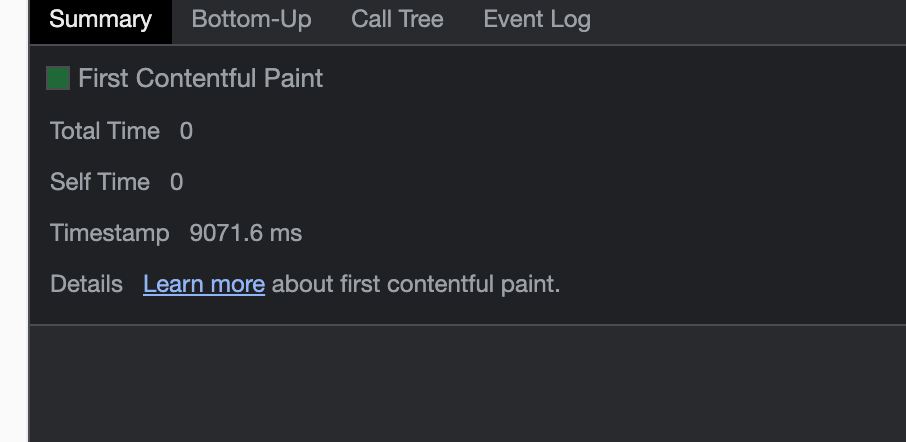
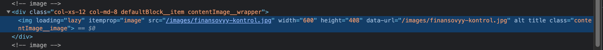

# Домашняя работа

## Network

**1. На вкладке Network**

- [Записать и сохранить в HAR архив профиль загрузки ресурсов при открытии страницы](./Network/www.gd.ru.har)

### Найти неоптимальные места

1. Дублирование ресурсов
   
   
   
   
   
2. Лишний размер ресурса. Были выбраны файлы с лишними комментариями/большими отступами
   
   
   
   
   
   
3. Медленно загружающиеся ресурсы
   
4. Ресурсы, блокирующие загрузку
   
5. Что-то ещё (ресурсы которые упали с ошибкой)
   

### На вкладке Performance

1. [Записать и сохранить в файл профиль загрузки страницы](./Perfomance/Trace-20230618T015119.json)
2. Измерить время в миллисекундах от начала навигации до событий First Paint (FP), First Contentful Paint (FCP), Largest Contentful Paint (LCP), DOM Content Loaded (DCL), Load
   
   
   
   
   
3. Определить, на каком DOM-элементе происходит LCP
   
4. Измерить, сколько времени в миллисекундах тратится на разные этапы обработки документа (Loading, Scripting, Rendering, Painting)
   

### На вкладке Coverage

1. Cохранить скриншот вкладки после загрузки страницы
   
2. Измерить в килобайтах объём неиспользованного CSS в ходе загрузки страницы (198kB)
   
3. Измерить в килобайтах объём неиспользованного JS в ходе загрузки страницы (1.4MB)
   

## Дополнительное задание

### Найти неоптимальные места

Slow полностью совпадает с анализом неоптимальных мест выше по тексту

1. [Записать и сохранить в HAR архив профиль загрузки ресурсов при открытии страницы](./Slow/www.gd.ru.har)

### На вкладке Performance

1. [Записать и сохранить в файл профиль загрузки страницы](./Slow/Trace-20230618T020748.json)
2. Измерить время в миллисекундах от начала навигации до событий First Paint (FP), First Contentful Paint (FCP), Largest Contentful Paint (LCP), DOM Content Loaded (DCL), Load
   
   
   
   
   
3. Определить, на каком DOM-элементе происходит LCP
   
4. Измерить, сколько времени в миллисекундах тратится на разные этапы обработки документа (Loading, Scripting, Rendering, Painting)
   

### На вкладке Coverage

1. Cохранить скриншот вкладки после загрузки страницы
   
2. Измерить в килобайтах объём неиспользованного CSS в ходе загрузки страницы(211kB)
   
3. Измерить в килобайтах объём неиспользованного JS в ходе загрузки страницы(1.6MB)
   
